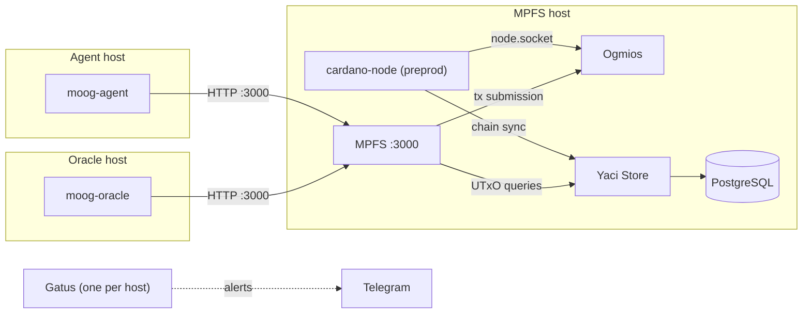

# High-Assurance Lab Team

High Assurance Lab team repository.

## What is this

This repository contains documentation, reports, plans, roadmaps, and more generally all kind of artifacts related to the _High Assurance Lab_ (HAL) team at the [Cardano Foundation](https://cardano.org) which are cutting across other projects' boundaries.

Concretely, it holds:

- the team [handbook](docs/handbook.md) and process documents ([asynchronous communication](docs/async.md), [interviews](docs/interviews.md), the [Radicle evaluation](docs/radicle.md), [Homebrew packaging notes](docs/homebrew.md));
- [weekly](docs/weekly) and [monthly](docs/monthly) meeting notes and reports;
- cryptography learning material for ZKP ([gitbook](docs/crypto/gitbook.md), [journal](docs/crypto/journal.md), training slides);
- the [infrastructure](infrastructure) configuration for the team's preprod deployments (MPFS stack, Moog agent and oracle, Gatus monitoring);
- a [README template](templates/README.md) for new projects.

Code for the team's products lives in the project repositories listed below, not here.

## Projects

For projects' specific items (code, issues, patches, etc...), refer to the following repositories.
Each project's status is identified by an icon:

* 🔒 : Project is in maintenance mode, no new feature will be developed
* 💀: Project is not maintained nor developed
* 🚧 : Project is actively being developed but not ready for widespread usage yet
* 🚢 : Project is live and actively being developed
* 📢 : Project is gathering feedback
* 💡 : Project is at ideation stage

| Project                   | Comment                                                                 | Status | Version                                                                                      | URL                                                                     |
|---------------------------|-------------------------------------------------------------------------|--------|----------------------------------------------------------------------------------------------|-------------------------------------------------------------------------|
| `cardano-wallet`          | Historically the main focus of the team                                 | 🔒     | [v2026-05-11](https://github.com/cardano-foundation/cardano-wallet/releases/tag/v2026-05-11) | [github](https://github.com/cardano-foundation/cardano-wallet)          |
| `cardano-wallet-agda`     | Formal specification for some wallet features                           | 🔒     |                                                                                              | [github](https://github.com/cardano-foundation/cardano-wallet-agda)     |
| `cardano-addresses`       | CLI tool for addresses and mnemonic manipulation & derivations          | 🚢     | [4.0.5](https://github.com/IntersectMBO/cardano-addresses/releases/tag/4.0.5)                | [github](https://github.com/IntersectMBO/cardano-addresses)             |
| `cardano-crypto`          | Library for low-level crypto                                            | 🔒     |                                                                                              | [github](https://github.com/IntersectMBO/cardano-crypto)                |
| `moog`                    | Antithesis CLI client  for Cardano ecosystem                            | 🚢     | [v0.5.1.5](https://github.com/cardano-foundation/moog/releases/tag/v0.5.1.5)                 | [github](https://github.com/cardano-foundation/moog)                    |
| `mpfs`                    | Merkle-Patricia-Forestry generic service                                | 🚧     | [v1.3.0](https://github.com/cardano-foundation/mpfs/releases/tag/v1.3.0)                     | [github](https://github.com/cardano-foundation/mpfs)                    |
| `cardano-deposit-wallet`  | Safer and faster experimental wallet                                    | 💀     |                                                                                              | [github](https://github.com/cardano-foundation/cardano-deposit-wallet)  |
| `pop`                     | Track software lifecycle on Cardano (repository archived)               | 💀     |                                                                                              | [github](https://github.com/cardano-scaling/pop)                        |
| `vrf`                     | Library for VRF crypto                                                  | 🚧     |                                                                                              | [github](https://github.com/txpipe/vrf)                                 |
| `kes`                     | Library for KES crypto                                                  | 🚧     |                                                                                              | [github](https://github.com/txpipe/kes)                                 |
| `cardano-wallet-client`   |                                                                         | 💀     |                                                                                              | [github](https://github.com/cardano-foundation/cardano-wallet-client)   |
| `amaru`                   | Rust Cardano node                                                       | 🚧     |                                                                                              | [github](https://github.com/pragma-org/amaru)                           |
| `cardano-node-antithesis` | Testing the Haskell cardano node                                        | 🚧     |                                                                                              | [github](https://github.com/cardano-foundation/cardano-node-antithesis) |

## Architecture

The only runnable artifact in this repository is the deployment configuration under [infrastructure/](infrastructure), which runs the team's preprod MPFS service and the Moog agent and oracle that consume it:

See [infrastructure/README.md](infrastructure/README.md) for the per-host details.

## Documentation

* [Roadmap](https://github.com/orgs/cardano-foundation/projects/27/views/1)
* [Handbook](docs/handbook.md) — how the team works
* [Weekly meetings](docs/weekly)
* [Cryptography prerequisites for ZKP](docs/crypto/gitbook.md)
* [Infrastructure](infrastructure/README.md) — preprod deployments and monitoring

For AI agents, start at [AGENTS.md](AGENTS.md).

## Development

This is a documentation and configuration repository: there is nothing to build. Changes follow the [Git workflow described in the handbook](docs/handbook.md#git-workflow); documentation-only changes may be committed directly to `main`. New project READMEs should follow the [template](templates/README.md).
