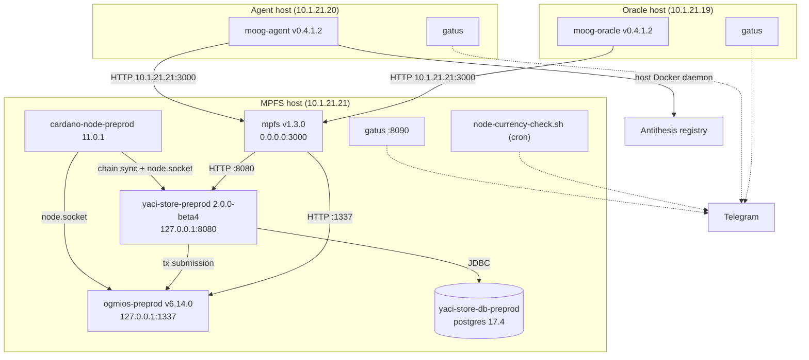

# HAL Infrastructure

Deployment configuration for the team's preprod services. Three hosts on CF infrastructure each run a Docker Compose stack from a checkout of this repository at `/opt/hal`:

| Host | Address | Stack | Directory |
|------|---------|-------|-----------|
| MPFS | 10.1.21.21 | cardano-node + Ogmios + Yaci Store + MPFS, Gatus, node currency check | [mpfs/](mpfs), [gatus/mpfs/](gatus/mpfs), [scripts/](scripts) |
| Agent | 10.1.21.20 | Moog agent, Gatus | [moog/agent/](moog/agent), [gatus/agent/](gatus/agent) |
| Oracle | 10.1.21.19 | Moog oracle, Gatus | [moog/oracle/](moog/oracle), [gatus/oracle/](gatus/oracle) |

SSH access goes through the CF jumpbox; see [docs/deployment/anti-services.md](../docs/deployment/anti-services.md) for the `.ssh/config` stanzas.

## Architecture

## Components

### [mpfs/](mpfs)

The preprod [MPFS](https://github.com/cardano-foundation/mpfs) stack: a `cardano-node` following preprod, [Ogmios](https://ogmios.dev) for transaction submission, [Yaci Store](https://github.com/bloxbean/yaci-store) (backed by PostgreSQL) as UTxO indexer, and the MPFS service itself, published on port 3000. An `autoheal` container restarts anything whose healthcheck fails. See [mpfs/README.md](mpfs/README.md) for setup, including the Mithril snapshot bootstrap.

### [moog/](moog)

The [Moog](https://github.com/cardano-foundation/moog) agent and oracle deployments, each a single-service compose file pinned to a released Moog image. Both reach MPFS at `http://10.1.21.21:3000` and load their wallets and secrets from files on the host. See [moog/agent/README.md](moog/agent/README.md) and [moog/oracle/README.md](moog/oracle/README.md).

### [gatus/](gatus)

One [Gatus](https://github.com/TwiN/gatus) instance per host, alerting to Telegram (credentials from `/home/paolino/secrets/gatus/.env`, defining `TELEGRAM_BOT_TOKEN` and `TELEGRAM_CHAT_ID`):

- `gatus/mpfs` (web UI on port 8090, to avoid clashing with Yaci Store on 8080) checks that MPFS answers `/tokens` **and** its indexer tip equals the network tip, that Ogmios is healthy and fully synchronized, that Yaci Store's actuator reports UP, and that the node head is fresh (`networkSynchronization == 1` — catches a node frozen by a hard fork).
- `gatus/agent` and `gatus/oracle` check that MPFS is reachable from their respective hosts.

### [scripts/](scripts)

[`node-currency-check.sh`](scripts/node-currency-check.sh) is a cron-driven companion to the Gatus node-head check: it compares the image tags of running `cardano-node` containers against the latest IntersectMBO release and warns on Telegram *before* an outdated node freezes at a preprod/preview hard fork. It alerts only when the situation changes, so a daily cron does not spam.
